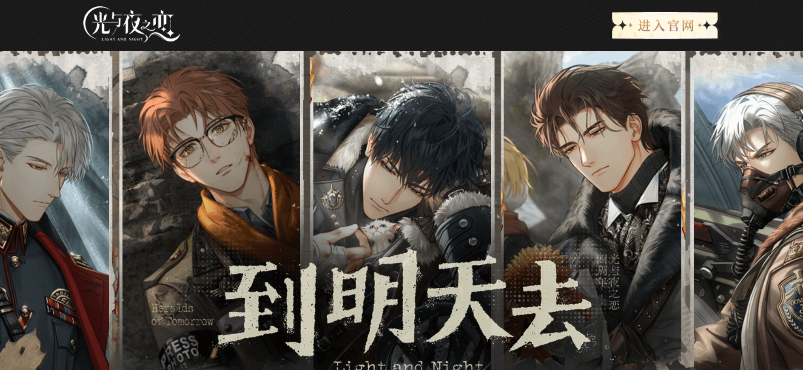
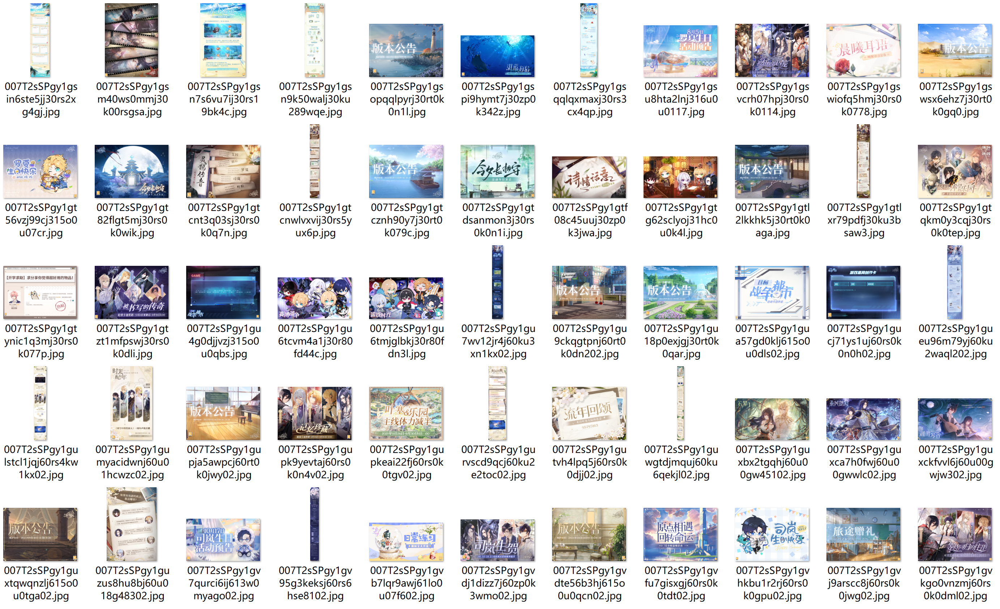
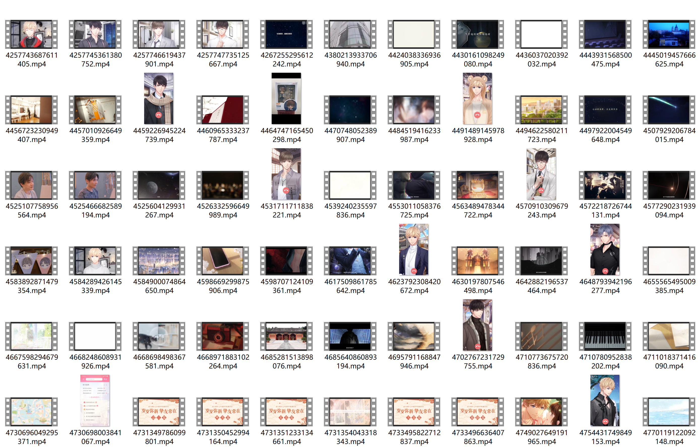

# OtomeVM Dataset

## 📁 Repository Structure

> ⚠️ **Note:** Due to size limitations, all video files associated with this dataset are hosted externally via Google Drive.  

The contents of this repository are organized as follows:

OtomeVM/  
├── README.md # Dataset documentation and usage instructions  
├── Images/ # Visuals used in the README  
│   ├── Cover.png  
│   ├── picdata.png  
│   └── videodata.png  
├── OtomeVM_Post.xlsx # Main dataset file (posts and metadata)  
├── OtomeVM_Pics/ # Folder containing image zip files by game  
│   ├── FATPicDoc.zip  
│   ├── LNPicDoc.zip  
│   ├── MDPPicDoc.zip  
│   ├── MQCPicDoc.zip  
│   └── ToTPicDoc.zip  
└── 🔗 [OtomeVM_Videos (Google Drive)](https://drive.google.com/drive/folders/1OgxrJPFoNwFfu1pui77rfEUFMz3G5rH6?usp=sharing)

All files are self-contained. You may download the full repository or selected components as needed.

> 🔹 The linked `OtomeVM_Videos` folder contains five subfolders named by game (e.g., `FATvideos`, `LNvideos`, etc.).  
> 🔹 Each game's folder includes two subfolders: `Original/` for the raw videos and `Compressed/` for resolution- and framerate-reduced versions.

---

## 📦 Dataset Description

If you use this dataset, please cite our paper:

> TBD.

The **OtomeVM** dataset contains social media marketing data collected from official Sina Weibo posts by five popular otome games. The dataset captures **viral marketing (VM)** campaigns including post content, timestamps, engagement metrics (likes, reposts, comments), and associated multimedia (images and videos).

- **Collection Period:** From each game's first VM record on Weibo until **February 29, 2024**.
- **Games and Abbreviations:**

| Game Title                | Abbreviation | First Collected Post |
|--------------------------|--------------|-----------------------|
| For all Time             | FAT          | 2019-08-20            |
| Light and Night          | LN           | 2020-03-06            |
| Mr. Love: Deep Space     | MDP          | 2020-10-23            |
| Mr. Love: Queen's Choice | MQC          | 2017-07-06            |
| Tears of Themis          | ToT          | 2019-07-29            |

- **Total Posts Collected:** 9,614

---

## 📑 Feature Overview

The following table outlines the features included in the dataset, along with descriptions and examples:

| Feature        | Description                                                                                      | Example                                                                 |
|----------------|--------------------------------------------------------------------------------------------------|-------------------------------------------------------------------------|
| `post_id`      | 16-digit unique identifier for each post                                                        | `4126473277600069`                                                     |
| `post_url`     | URL of the post on Weibo                                                                         | `https://weibo.com/3248438592/Fb6GPvT7L`                               |
| `content`      | Text content of the post as published by the game account                                        | `将首次参战广州萤火虫漫展！7月15日~18日，锁定妖都！...`       |
| `long_text`    | Whether the post is considered a long-text post (TRUE/FALSE)                                     | `TRUE`                                                                  |
| `year/month/day/time` | Timestamp of the post (split into fields)                                                 | `11:22:38 AM 6/7/2017`                                                 |
| `pic_num`      | Number of pictures attached to the post                                                          | `3`                                                                     |
| `pic_url`      | URL(s) of the attached pictures                                                                  | `https://wx2.sinaimg.cn/orj960/c19f3d40gy1fha00iuna6j20ku0ku0vv.jpg`    |
| `video_url`    | URL of the attached video (if any)                                                               | `http://miaopai.com/show/...`                                          |
| `view_num`     | Number of views for the video                                                                    | `9819188`                                                               |
| `video_duration` | Duration of the video in seconds                                                              | `93`                                                                    |
| `video_title`  | Title of the video                                                                                | `《恋与制作人》CV访谈第四弹 —— 夏磊`                                    |
| `reposts_num`  | Number of reposts the post received                                                               | `6492`                                                                  |
| `comments_num` | Number of comments received                                                                       | `3857`                                                                  |
| `likes_num`    | Number of likes                                                                                   | `4922`                                                                  |
| `Game`         | The game this post belongs to (see abbreviation above)                                           | `FAT`                                                                   |

---

## 🖼️ Multimedia Files

- All **image files** are provided as individual zip archives by game:
  - `FATPicDoc.zip` – For all Time  
  - `LNPicDoc.zip` – Light and Night  
  - `MDPPicDoc.zip` – Mr. Love: Deep Space  
  - `MQCPicDoc.zip` – Mr. Love: Queen's Choice  
  - `ToTPicDoc.zip` – Tears of Themis  

  These files are available in the `OtomeVM_Pics/` folder in this repository.

- All corresponding **video files are hosted externally via Google Drive**:
  - 🔗 [OtomeVM Video Files (Google Drive)](https://drive.google.com/drive/folders/1OgxrJPFoNwFfu1pui77rfEUFMz3G5rH6?usp=sharing)

  The linked folder contains a directory named `OtomeVM_Videos`, which includes subfolders for each game:
  - `FATvideos/`
  - `LNvideos/`
  - `MDSvideos/`
  - `MQCvideos/`
  - `ToTvideos/`

  Within each game folder, there are two subdirectories:
  - `Original/` – contains the raw video files as named by the last segment of the original Weibo media URL.
  - `Compressed/` – contains compressed versions of the same videos.

  Compressed videos are processed by reducing the **resolution to 720P** and the **frame rate to 10 frames per second**, significantly reducing file size for efficient storage and transfer.  
  File names remain consistent, with the compressed versions prefixed with `"compressed"` for clarity.  
  Please download from the appropriate folder according to your needs.

### 🧷 Sample Picture Data Overview

### 🎬 Sample Video Data Overview

---

## 📄 License

[![CC BY-NC 4.0][cc-by-nc-shield]][cc-by-nc]

OtomeVM © 2024 by Syrios is licensed under Creative Commons Attribution-NonCommercial 4.0 International.

[cc-by-nc]: https://creativecommons.org/licenses/by-nc/4.0/  
[cc-by-nc-shield]: https://licensebuttons.net/l/by-nc/4.0/88x31.png

You are free to:
- Share — copy and redistribute the material
- Adapt — remix, transform, and build upon the material

**Under the following terms:**
- **Attribution** — You must give appropriate credit.
- **NonCommercial** — You may not use the material for commercial purposes.

For full license text, see: https://creativecommons.org/licenses/by-nc/4.0/

---
